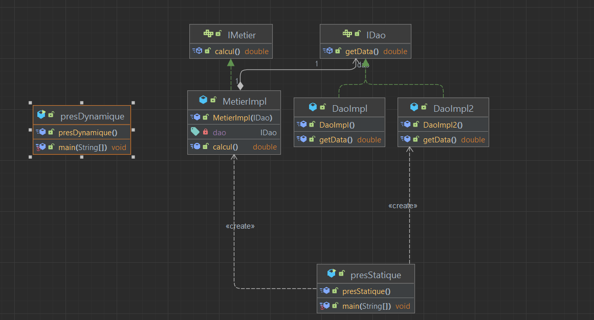

# Inversion de Contrôle et Injection de Dépendances

## Introduction
Ce projet démontre les principes d'Inversion de Contrôle (IoC) et d'Injection de Dépendances (DI) en Java, deux concepts fondamentaux pour développer des applications modulaires et maintenables.

## Diagramme de classes



## Explication des concepts

### Inversion de Contrôle (IoC)
L'Inversion de Contrôle est un principe de conception où le contrôle du flux d'exécution d'un programme est inversé : au lieu que le composant principal contrôle la création et la gestion des dépendances, ce contrôle est délégué à l'extérieur du composant.

**Principe traditionnel :** Un composant crée et gère lui-même ses dépendances.
```java
public class ServiceA {
    private final ServiceB serviceB;
    
    public ServiceA() {
        // ServiceA contrôle la création de ServiceB
        this.serviceB = new ServiceB();
    }
}
```

**Avec IoC :** Un composant reçoit ses dépendances de l'extérieur.
```java
public class ServiceA {
    private final InterfaceB serviceB;
    
    // ServiceA ne contrôle plus la création de l'implémentation
    public ServiceA(InterfaceB serviceB) {
        this.serviceB = serviceB;
    }
}
```

L'IoC inverte ainsi la responsabilité de gestion des dépendances, la déplaçant du composant vers un "conteneur" externe.

### Injection de Dépendances (DI)
L'Injection de Dépendances est un mécanisme qui implémente le principe d'IoC. Elle consiste à fournir à un objet ses dépendances plutôt que l'objet les crée lui-même.

**Méthodes d'injection principales :**

1. **Injection par constructeur** (utilisée dans ce projet) :
   ```java
   public MetierImpl(IDao dao) {
       this.dao = dao;
   }
   ```

2. **Injection par setter** :
   ```java
   public void setDao(IDao dao) {
       this.dao = dao;
   }
   ```

3. **Injection par champ** (moins recommandée) :
   ```java
   @Inject
   private IDao dao;
   ```

Le DI permet de découpler la création et l'utilisation des objets, favorisant ainsi la modularité et la testabilité.

## Structure du projet
```
src/
├── dao/
│   ├── IDao.java         # Interface DAO
│   └── DaoImpl.java      # Implémentation principale
├── extension/
│   └── DaoImpl2.java     # Implémentation alternative
├── metier/
│   ├── IMetier.java      # Interface métier
│   └── MetierImpl.java   # Implémentation métier
└── presentation/
    ├── presStatique.java # Instanciation statique
    └── presDynamique.java # Instanciation dynamique
```

## Concepts clés

### Couplage faible
La classe métier dépend d'une interface (`IDao`) et non d'une implémentation concrète :
```java
public class MetierImpl implements IMetier {
    private IDao dao; // Couplage faible via l'interface
    // ...
}
```

### Injection de dépendances
Les dépendances sont fournies de l'extérieur plutôt que créées à l'intérieur des classes :
```java
// Injection via constructeur
public MetierImpl(IDao dao) {
    this.dao = dao;
}
```

### Inversion de Contrôle
Deux approches d'instanciation sont présentées :

1. **Approche statique** (présentation/presStatique.java)
   ```java
   // Les objets sont créés et assemblés explicitement dans le code
   DaoImpl2 d = new DaoImpl2();
   MetierImpl metier = new MetierImpl(d);
   ```

2. **Approche dynamique** (présentation/presDynamique.java)
   ```java
   // Les objets sont créés et assemblés à partir d'une configuration externe
   Scanner scanner = new Scanner(new File("config.txt"));
   String daoClassName = scanner.nextLine();
   Class cd = Class.forName(daoClassName);
   IDao d = (IDao) cd.getConstructor().newInstance();
   
   String metierClassName = scanner.nextLine();
   Class m = Class.forName(metierClassName);
   IMetier metier = (IMetier) m.getConstructor(IDao.class).newInstance(d);
   ```

## Configuration
Le fichier `config.txt` spécifie les implémentations à utiliser :
```
extension.DaoImpl2
metier.MetierImpl
```

## Importance de l'IoC et du DI

### Avantages techniques
- **Modularité** : Les composants sont faiblement couplés et interchangeables
- **Extensibilité** : Nouvelles implémentations ajoutées sans modifier le code existant
- **Testabilité** : Facilite l'injection de mocks pour les tests unitaires
- **Réutilisabilité** : Les composants peuvent être réutilisés dans différents contextes

### Bénéfices pour le développement
- **Séparation des préoccupations** : Chaque module a une responsabilité unique et bien définie
- **Développement parallèle** : Différentes équipes peuvent travailler sur différents modules simultanément
- **Maintenance simplifiée** : Les changements sont localisés et n'affectent pas l'ensemble du système
- **Évolutivité** : Le système peut évoluer par ajout de modules plutôt que par modification

### Impact sur l'architecture
- **Respect du principe Open/Closed** : Ouvert à l'extension, fermé à la modification
- **Favorise les bonnes pratiques** : Encourage la programmation orientée interface
- **Architecture adaptative** : Capacité à changer de comportement sans recompilation
- **Réduction de la dette technique** : Code plus propre et plus facile à maintenir sur le long terme

L'approche dynamique, en particulier, illustre comment un système peut être configuré et assemblé au runtime, offrant une flexibilité maximale pour adapter le comportement de l'application selon les besoins sans avoir à modifier le code source.
