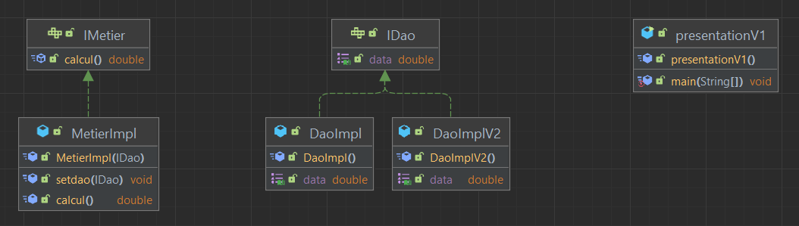

# Rapport TP : Inversion de Contrôle et Injection de Dépendances avec Spring

## Introduction

Ce rapport analyse l'implémentation de l'Inversion de Contrôle (IoC) et l'Injection de Dépendances (DI) dans un projet Spring utilisant deux approches différentes : la configuration par XML et la configuration par annotations.

## Structure du projet

Le projet est organisé selon une architecture en couches :

- **Couche DAO** : Accès aux données (`IDao`, `DaoImpl`, `DaoImplV2`)
- **Couche Métier** : Logique métier (`IMetier`, `MetierImpl`)
- **Couche Présentation** : Point d'entrée de l'application (`presentationV1`, `presSpringXml`, `presSpringAnnotation`)

## Diagramme de classes



## Analyse des différentes approches d'Injection de Dépendances

### 1. Instanciation statique (couplage fort)

Dans la classe `presentationV1`, l'injection est réalisée manuellement sans l'utilisation du conteneur Spring :

```java
DaoImplV2 dao = new DaoImplV2();
MetierImpl metier = new MetierImpl(dao); // injection via le constructeur
//metier.setdao(dao); // injection via setter
```

**Observations** :
- Cette approche crée un couplage fort entre les couches
- Les dépendances sont instanciées explicitement
- Le changement d'implémentation nécessite une modification du code source

### 2. Approche Spring par fichier XML

Dans la classe `presSpringXml`, l'injection est gérée par Spring via un fichier de configuration XML :

```java
ApplicationContext context = new ClassPathXmlApplicationContext("config.xml");
IMetier metier = context.getBean(IMetier.class);
```

**Équivalences importantes** :
- L'instruction `Class.forName()` en Java pur correspond à la déclaration d'un bean dans le XML :
  ```xml
  <bean id="dao" class="ma.khairy.dao.DaoImpl"></bean>
  ```

**Avantages** :
- Configuration centralisée
- Possibilité de changer l'implémentation sans toucher au code
- Couplage faible entre les couches

### 3. Approche Spring par annotations

Dans la classe `presSpringAnnotation`, l'injection est gérée par Spring via les annotations :

```java
ApplicationContext context = new AnnotationConfigApplicationContext("ma.khairy");
IMetier metier = context.getBean(IMetier.class);
```

**Équivalences importantes** :
- L'annotation `@Component` est équivalente à la déclaration d'un bean dans le XML
- Le scan des packages remplace la configuration manuelle des beans

## Analyse des annotations utilisées

### @Component
- **Utilisation** : Déclare une classe comme étant un bean Spring
- **Exemple** : `@Component("dao")` dans `DaoImpl`
- **Équivalent XML** : `<bean id="dao" class="ma.khairy.dao.DaoImpl"></bean>`

### @Autowired
- **Utilisation** : Injection automatique des dépendances
- **Problématique** : Accède directement aux attributs privés, ce qui viole le principe d'encapsulation de la POO
- **Note** : Cette annotation est commentée (`//    @Autowired`), favorisant l'injection par constructeur

### @Qualifier
- **Utilisation** : Précise quelle implémentation utiliser lorsque plusieurs beans du même type existent
- **Exemple** : `public MetierImpl(@Qualifier("dao") IDao dao)`
- **Cas d'utilisation** : Nécessaire ici car deux implémentations de `IDao` existent (`dao` et `dao2`)

## Points importants à retenir

1. **Constructeur avec paramètres** : Dans la version avec annotations, il est important de ne pas avoir uniquement un constructeur sans paramètre car Spring ne saura pas quel constructeur utiliser lors de l'injection de dépendances.

2. **Problème d'encapsulation avec @Autowired** : L'utilisation de `@Autowired` directement sur un attribut privé viole le principe d'encapsulation de la POO car Spring utilise la réflexion pour accéder directement aux attributs privés. L'injection par constructeur ou par setter est préférable.

3. **Utilisation de @Qualifier** : Cette annotation est nécessaire lorsque plusieurs implémentations d'une même interface sont disponibles, pour préciser laquelle doit être injectée.

## Conclusion

Ce TP illustre les différentes approches d'implémentation de l'IoC et du DI avec Spring :
- L'approche par instanciation statique (couplage fort)
- L'approche Spring par fichier XML
- L'approche Spring par annotations

L'utilisation du conteneur Spring (que ce soit par XML ou annotations) permet un couplage faible entre les composants de l'application, facilitant ainsi la maintenance et les tests. L'approche par annotations simplifie la configuration mais nécessite une bonne compréhension des annotations et de leurs implications.
